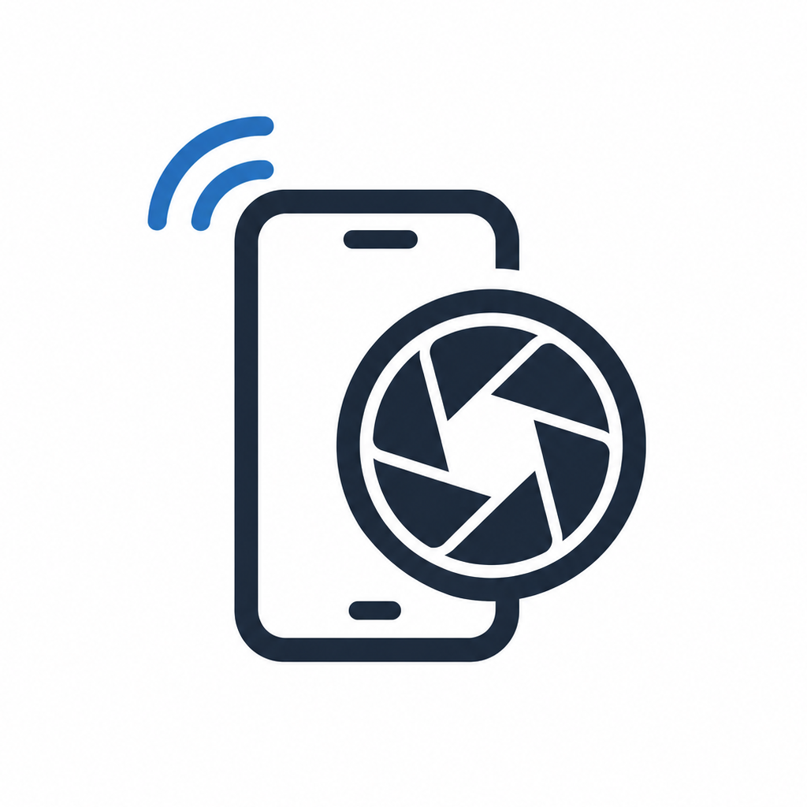

<p align="center">  </p> <h1 align="center">📷 PCam</h1> <p align="center"> Portable, Ultra-Low Latency Android Webcam for Windows </p> <p align="center">       </p> <p align="center"> <a href="https://github.com/Furkan-Demircan/PCam-MobileApp/releases">  </a> <a href="https://github.com/Furkan-Demircan/PCam-MobileApp/releases/latest">  </a> <a href="https://github.com/Furkan-Demircan/PCam-MobileApp/stargazers">  </a> </p>

# 📷 PCam - Remote Camera System

PCam is a portable, plug-and-play remote camera application that transforms your Android smartphone into a high-definition, ultra-low latency webcam for your PC.

Using hardware-accelerated H.264 streaming, PCam delivers smooth video feeds that can be bridged directly into popular video conferencing and streaming applications such as Zoom, Discord, Microsoft Teams, Skype, OBS Studio, and more.

The system consists of two components:

* **PCam Desktop Client** (Python / Tkinter)
* **PCam Mobile Broadcaster** (Android / Jetpack Compose / MediaCodec)

---

## ✨ Features

### 🚀 Zero-Configuration & Portable

The desktop client is distributed as a standalone executable.

Users do **not** need to install:

* Python
* FFmpeg
* ADB

Everything required is bundled inside the release package.

### ⚡ Low-Latency H.264 Pipeline

* Hardware-accelerated H.264 encoding
* Optimized frame transport
* Reduced latency
* Stable video transmission

### 🔗 Dual Connection Support

#### Wi-Fi Mode

* Automatic device discovery via mDNS
* No manual IP configuration
* One-click connection

#### USB Mode

* Automatic ADB tunneling
* Maximum stability
* Lowest possible latency
* Ideal for streaming and content creation

### 🔄 Remote Camera Controls

Control your smartphone directly from the desktop application:

* Switch front/back camera
* Toggle flashlight
* Rotate canvas

### 🎭 Virtual Camera Integration

PCam can forward video streams into OBS Virtual Camera, making your phone appear as a native webcam in:

* Zoom
* Discord
* Microsoft Teams
* Skype
* Google Meet
* Any DirectShow-compatible application

---

## 📦 Release Package Structure

After extracting the release archive:

```text
PCam/
│
├── PCam.exe
│
├── Binaries/
│   ├── ffmpeg.exe
│   ├── adb.exe
│   ├── AdbWinApi.dll
│   └── AdbWinUsbApi.dll
│
└── Images/
    └── PCam_logo.png
```

### Included Components

| File             | Description                 |
| ---------------- | --------------------------- |
| PCam.exe         | Main desktop application    |
| ffmpeg.exe       | Embedded H.264 decoder      |
| adb.exe          | Embedded Android USB bridge |
| AdbWinApi.dll    | ADB dependency              |
| AdbWinUsbApi.dll | ADB dependency              |
| PCam_logo.png    | Application branding asset  |

---

## 📱 Installing the Mobile Broadcaster

1. Transfer `PCam-MobileApp.apk` to your Android device.
2. Install the APK.
3. Allow installation from unknown sources if prompted.
4. Launch the application.
5. Grant camera permissions.

---

## 🔌 Connecting Your Device

### Option A — Wi-Fi Connection

1. Connect both devices to the same network.
2. Launch `PCam.exe`.
3. Wait for the status indicator to show:

```text
Searching for devices...
```

4. Press the broadcast button in the Android application.
5. PCam automatically discovers the device via mDNS.
6. The status changes to:

```text
Connected [Wi-Fi]
```

---

### Option B — USB Connection (Recommended)

1. Enable **Developer Options** on Android.
2. Enable **USB Debugging**.
3. Connect the device via USB.
4. Accept the authorization dialog on the phone.
5. Launch `PCam.exe`.

PCam automatically:

* Detects the device
* Creates an ADB tunnel
* Starts video transmission

Status indicator:

```text
Connected [USB]
```

---

## 🎭 Using PCam in Zoom, Discord & Teams

### Install OBS Studio

Install OBS Studio if it is not already installed.

OBS provides the required Virtual Camera driver.

### Start PCam

1. Connect your phone.
2. Verify that the preview is visible.

### Enable Virtual Camera Output

Enable:

```text
Send to Virtual Camera
```

from the settings panel.

### Select OBS Virtual Camera

Inside your video conferencing software:

1. Open Video Settings.
2. Select:

```text
OBS Virtual Camera
```

Your smartphone feed is now available as a webcam.

---

## ⚙️ Troubleshooting

### Green Screen or Corrupted Pixels

In unstable wireless environments, the initial H.264 keyframe may arrive fragmented.

If the preview appears green or heavily pixelated:

1. Click **Switch Camera** once.
2. The mobile encoder will generate a fresh keyframe.
3. The stream should immediately recover.

---

### Temporary Disconnect Messages

PCam includes an intelligent timeout threshold of **4 seconds**.

Short packet loss events will not immediately terminate the stream.

For maximum stability, use USB mode.

---

### Windows Defender SmartScreen Warning

Because PCam is distributed as a standalone executable generated using PyInstaller and does not currently include a commercial code-signing certificate, Windows may display:

```text
Windows protected your PC
```

This is a common false positive for independent software distributions.

PCam:

* Is open source
* Contains no malware
* Does not install background services
* Cleans up all spawned processes on exit

---

## 👨‍💻 Local Development

### Requirements

* Python 3.10+
* FFmpeg
* Android SDK Platform Tools (optional)

### Install Dependencies

```bash
pip install pillow opencv-python numpy zeroconf pyvirtualcam
```

### Run Desktop Client

```bash
python PCam-MobileApp.py
```

---

## 📦 Building a Release

Install PyInstaller:

```bash
pip install pyinstaller
```

Generate a standalone executable:

```bash
pyinstaller PCam-MobileApp.spec --clean
```

---

## 💡 Architecture Notes

PCam was designed with resource efficiency in mind.

Core design principles:

* Asynchronous networking
* Hardware-accelerated video encoding
* Minimal memory allocations
* Lightweight desktop UI
* Event-driven architecture

This allows PCam to deliver low-latency video streaming while maintaining low CPU and memory usage on both desktop and mobile devices.

📄 License

This project is licensed under the MIT License - see the LICENSE file for details.
